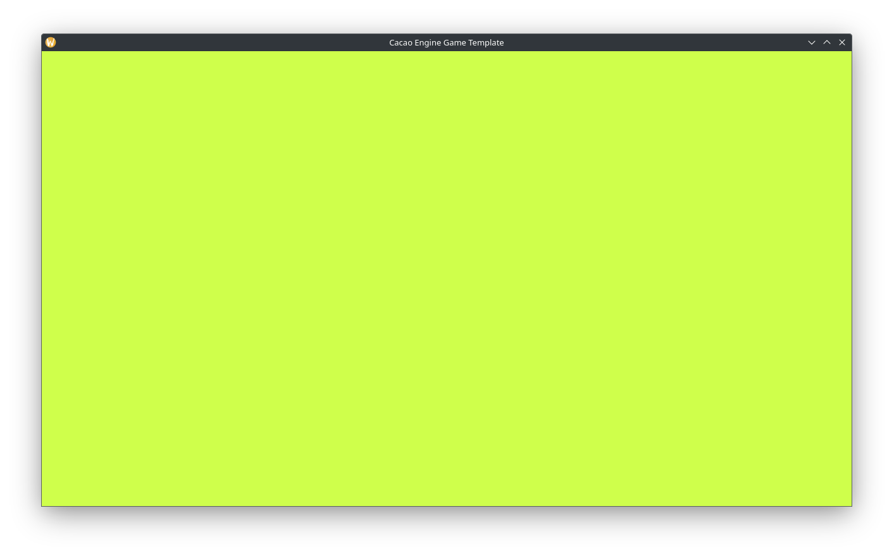

# Quickstart

## Creating a base project
The easiest way to use Cacao Engine is to build it alongside your game. Using Git, clone the repository at `https://github.com/RobotLeopard86/CacaoEngine-Game-Template`. This repository contains an ideal setup for creating a Cacao Engine game.

## Building
Install the dependencies as listed in the [build instructions](./building).  
If you'd like to use Visual Studio, see the [Visual Studio compatibility guide](./vs) for info on how to set up a Visual Studio Solution.  
Otherwise, run `meson setup build` if on Windows or `meson setup build --native-file posix_native.ini` if on Linux or macOS to create a build directory, then run `ninja -C build run` to build and run the template.
If all goes well, you should see something like this:  


## Breaking down the template
The main part of this template is the `src/Game.cpp` file. It is the entrypoint for your game. Let's walk through it step-by-step.  
```
#ifdef _WIN32
#define EXPORT __declspec(dllexport)
#else
#define EXPORT
#endif
```  
This is some C++ preprocessor stuff to make sure that our hook functions are always accessible. On most POSIX systems, all symbols in a shared library are automatically exported, meaning they are visible to other files. On Windows, however, everything in a shared library (DLL) is invisible by default, and must be exported.  

```
#include "Cacao.hpp"
```  
Here we include the Cacao Engine header file, giving us access to all of the Cacao Engine functions we need.  

```
extern "C" {...}
```  
This is telling the C++ compiler, "Hey! Keep these function names exactly like they are!". By default, C++ compilers "mangle" names, so as to avoid conflicts. Here though, we need these names preserved so the engine can find them. Now we move inside this block.  

```
EXPORT void _CacaoLaunch() {
	Cacao::Logging::ClientLog("Hi!");
	Cacao::WorldManager::GetInstance()->CreateWorld<Cacao::PerspectiveCamera>("World");
	Cacao::WorldManager::GetInstance()->SetActiveWorld("World");
}
```
Here we define the startup hook function. Notice that it's marked with the `EXPORT` macro from earlier. This function is called by the engine to set up your game before the run loop.  
Inside this function, we log `Hi!` to the console, create a world with a perspective camera named `World`, and set it as active.  
Note that the log function specifically says `ClientLog`. This is to distinguish messages coming from your game (the client) and the engine.  
You may also notice that everything is prefixed with `Cacao::`. All Cacao Engine things live in the `Cacao` namespace. If you want to omit this, add `using namespace Cacao;` right after including the `Cacao.hpp` header file.  
Lastly, many components of Cacao Engine follow the singleton pattern, meaning there is only ever one instance of them. In this function, we get the instance of the `WorldManager` to use it.  

```
EXPORT void _CacaoExiting() {
	Cacao::Logging::ClientLog("Bye!");
}
```  
Lastly, we define the shutdown hook function. Again, note that it's marked with the `EXPORT` macro. This function is called during engine shutdown, to clean up everything.